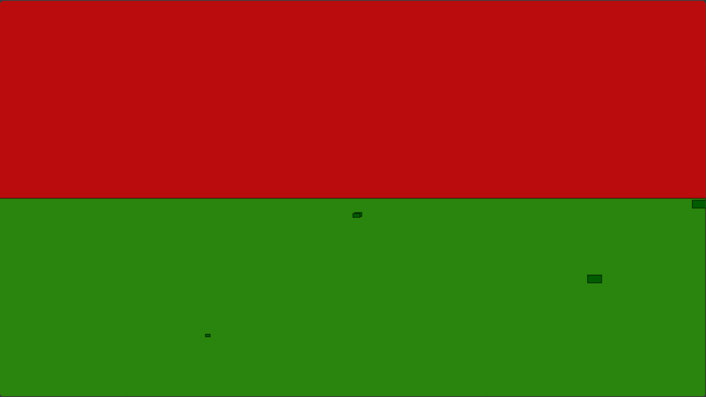

# Terrarium

A site where you can watch creatures interact with each other and influence their environment.

## How to use

Although the project is not available for demo yet, when it is it will be through a website or itch.io page.

### Controls

As controls are added to the game this section will be updated.

### How to run it locally

#### Dependencies

- HTML5 Canvas

#### Exact Commands

Right click on the file in your operating system's file explorer, and click "Run with" your desired browser.

## Upcoming Features

- Animals can interact directly with your mouse
- Animals can interact with any objects your move into your terrarium
- Animals can interact with each other
- Animals have certain traits that change over time and influence their actions
- Animals have certain needs that must be met, influencing their actions
- You can make observations about animals. If these observations are correct, you unlock new objects
- You can save your games into a code that can be inserted to restore your progress

## Technical Decisions

As the game progresses this section will be updated.

## Acknowledgements

As outside resources are used later in the project, this section will be updated.
